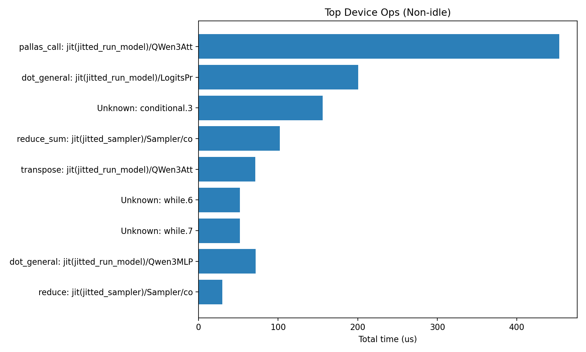
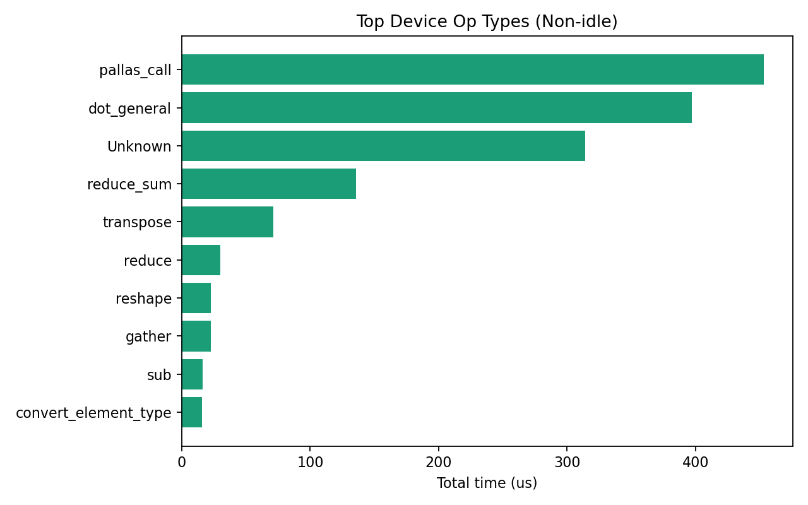
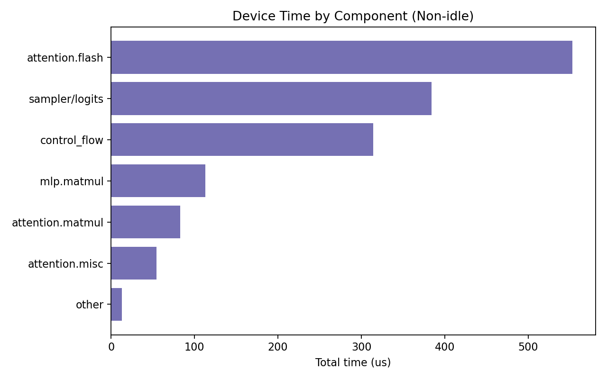
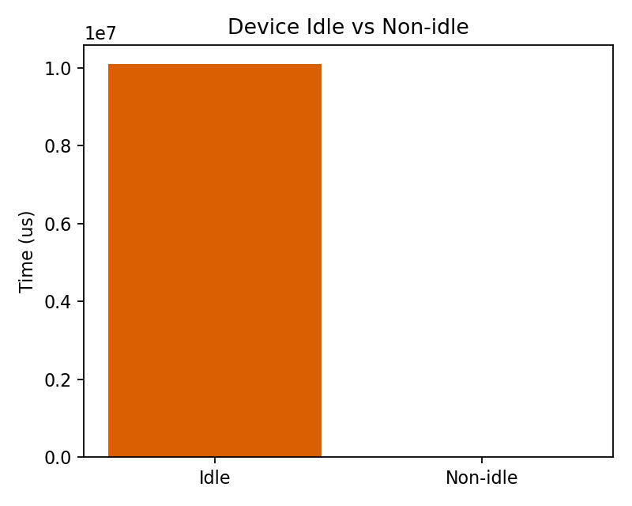
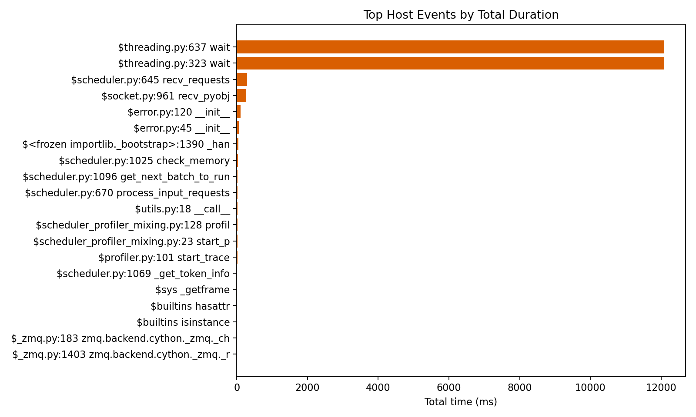

# RFC-011 Score API Profiling Report (TPU, JAX)

Date: 2026-02-05

## Executive Summary
- **Where the delay is:** Device time is dominated by **FlashAttention ragged‑paged attention** (`pallas_call`) and **matmul (`dot_general`)** in attention/MLP projections.
- **Host is mostly waiting:** Host trace shows scheduler receive/wait patterns; no heavy CPU hotspot in the score path.
- **Trace window is mostly idle:** Device non‑idle time is ~1.5 ms out of a ~10.09 s trace window (profiling captured idle time between requests).

If you care about request latency, the **compute that does happen** is overwhelmingly attention + matmul. The **lack of heavy host compute** suggests the score path is waiting on device execution or queueing, not CPU work.

## Quantitative Summary

| Metric | Value |
|---|---|
| Host trace window | 385.046 ms |
| Device total time | 10089943.2 us |
| Device idle time | 10088428.1 us (99.98%) |
| Device non-idle time | 1515.1 us (0.02%) |
| /v1/score requests in log | 3 (1 warmup + 2 profiled) |
| /start_profile calls | 1 |
| /stop_profile calls | 1 |

## Run Context

| Field | Value |
|---|---|
| Project | `sglang-jax-tests-1769450780` |
| TPU VM | `sglprof-20260205-184819` |
| Zone | `us-east5-b` |
| TPU | `v6e-1` (non-preemptible) |
| Image | `v6e-ubuntu-2404` |
| Model | `Qwen/Qwen3-0.6B` |
| Endpoint | `/v1/score` |
| JAX / jaxlib | `0.8.1 / 0.8.1` |
| libtpu | `0.0.30` |
| sglang-jax commit | `a18802ac38d209eacea09e040969262926781b80` |

Full environment details: `inputs/environment.md`

## Inputs
- Profile config: `inputs/profile_config.json`
- Score request: `inputs/score_request.json`
- Warmup request: `inputs/warmup_request.json`

## Artifacts

Raw traces:
- Host trace: `artifacts/raw/host/traces/`
- Device trace: `artifacts/raw/device/traces-device/`

Derived summaries:
- Host: `artifacts/derived/host/`
- Device: `artifacts/derived/device/`

Checksums:
- `checksums.txt`

## GCS Backup (Minimal Set)

GCS bucket:
- `gs://sglang-jax-profiles-20260205t201530z-score-f65a/20260205T201530Z_score_qwen3_0p6b_tpuv6e1/`

Uploaded (minimal, for reproducibility without massive size):
- `report.md`, `analysis/`, `images/`, `inputs/`, `logs/`, `checksums.txt`
- Host trace: `artifacts/raw/host/traces/t1v-n-3d21a6bb-w-0.trace.json.gz`
- Device trace: `artifacts/raw/device/.../t1v-n-3d21a6bb-w-0.trace.json.gz`
- Device op stats: `artifacts/raw/device/.../ALL_HOSTS.op_stats.pb`

Not uploaded (skipped to avoid slow transfer):
- Device XPlane: `artifacts/raw/device/.../t1v-n-3d21a6bb-w-0.xplane.pb`
- Host XPlane: `artifacts/raw/host/traces/t1v-n-3d21a6bb-w-0.xplane.pb`

Local path for the missing device XPlane (if you want to upload later):
- `artifacts/raw/device/traces-device/score_profile_device/plugins/profile/2026_02_05_20_15_30/t1v-n-3d21a6bb-w-0.xplane.pb`

## Findings

### 1) Device Time Dominated by FlashAttention + Matmul
From `analysis/device_top_ops.md` and `analysis/op_type_breakdown.md`:
- `pallas_call` (FlashAttention ragged‑paged attention) is the single biggest device op.
- `dot_general` (matmul) is the next largest contributor.
- Control‑flow ops (`Unknown`, `while`, `conditional`) are present but smaller.

Top non‑idle op‑type percentages:
- `pallas_call`: **29.9%** of non‑idle device time
- `dot_general`: **26.2%**
- `Unknown` (control flow): **20.7%**
- `reduce_sum`: **9.0%**

Top ops (non‑idle) summary:
- `analysis/device_top_ops.md`

Top device ops (non‑idle, top 10):

| Op type | Operation | Occurrences | Total us | Avg us | % of non-idle |
|---|---|---|---|---|---|
| pallas_call | jit(jitted_run_model)/QWen3Attention/FlashAttention/jit(ragged_paged_attention)/RPA-bq_32- | 1.0 | 453.051 | 453.051 | 29.90% |
| dot_general | jit(jitted_run_model)/LogitsProcessor/dot_general | 1.0 | 200.641 | 200.641 | 13.24% |
| Unknown | conditional.3 | 1.0 | 155.970 | 155.970 | 10.29% |
| reduce_sum | jit(jitted_sampler)/Sampler/cond/branch_0_fun/while/body/closed_call/reduce_sum | 31.0 | 102.006 | 3.291 | 6.73% |
| dot_general | jit(jitted_run_model)/Qwen3MLP/down_proj/dot_general | 1.0 | 71.736 | 71.736 | 4.73% |
| transpose | jit(jitted_run_model)/QWen3Attention/FlashAttention/jit(ragged_paged_attention)/transpose | 1.0 | 71.304 | 71.304 | 4.71% |
| Unknown | while.6 | 1.0 | 51.994 | 51.994 | 3.43% |
| Unknown | while.7 | 1.0 | 51.981 | 51.981 | 3.43% |
| dot_general | jit(jitted_run_model)/Qwen3MLP/gate_proj/dot_general | 1.0 | 41.394 | 41.394 | 2.73% |
| reduce | jit(jitted_sampler)/Sampler/cond/branch_0_fun/cond/branch_0_fun/reduce | 1.0 | 30.039 | 30.039 | 1.98% |

Op‑type breakdown:
- `analysis/op_type_breakdown.md`

Top op types (non‑idle, top 10):

| Op type | Total time (us) | % of non-idle |
|---|---|---|
| pallas_call | 453.1 | 29.9% |
| dot_general | 396.9 | 26.2% |
| Unknown | 314.1 | 20.7% |
| reduce_sum | 135.7 | 9.0% |
| transpose | 71.3 | 4.7% |
| reduce | 30.0 | 2.0% |
| reshape | 22.9 | 1.5% |
| gather | 22.5 | 1.5% |
| sub | 16.6 | 1.1% |
| convert_element_type | 16.0 | 1.1% |

Visuals:




Kernel provenance (where in the code this comes from):
- Ragged‑paged attention: `python/sgl_jax/srt/kernels/ragged_paged_attention/ragged_paged_attention.py:1668`
- FlashAttention backend: `python/sgl_jax/srt/kernels/ragged_paged_attention/flashattention_backend.py:489, 510`
- Radix attention wrapper: `python/sgl_jax/srt/kernels/radix_attention.py:64`
- Qwen3 model attention stack: `python/sgl_jax/srt/models/qwen3.py:132, 261, 337, 558`

### 2) Component Breakdown (Attention vs MLP vs Sampler)
We bucketed operations by component (attention, MLP, sampler/logits, control‑flow, other) using operation names in `framework_op_stats_device.json`.

- Component table: `analysis/component_breakdown.md`
- Chart: `images/component_breakdown.png`

Component breakdown (non‑idle):

| Component | Total time (us) | % of non-idle |
|---|---|---|
| attention.flash | 553.2 | 36.5% |
| sampler/logits | 384.1 | 25.4% |
| control_flow | 314.1 | 20.7% |
| mlp.matmul | 113.1 | 7.5% |
| attention.matmul | 83.1 | 5.5% |
| attention.misc | 54.4 | 3.6% |
| other | 13.0 | 0.9% |



### 3) Device Idle vs Non‑Idle
The trace window includes idle time between requests.

- Idle vs non‑idle summary: `analysis/idle_vs_non_idle.md`
- Chart: `images/idle_vs_non_idle.png`

Idle vs non‑idle (trace window):

| Category | Time (us) | % of device time |
|---|---|---|
| Idle | 10088428.1 | 99.98% |
| Non-idle | 1515.1 | 0.02% |



In this run, device idle time is **~99.985%** of the trace window. That is expected because the profiler was open across a wide window and only two score requests were sent. The compute inside the request is still dominated by attention + matmul.

### 4) Host Trace: Scheduler + Wait
Host trace analysis shows the server mostly waiting and receiving requests. This indicates the score path is not CPU‑bound in this run.

- Host trace summary: `analysis/host_trace_summary.md`
- Server log: `logs/server-device.log`

Host top events (by total duration):

| Event | Count | Total ms |
|---|---|---|
| $threading.py:637 wait | 2 | 12085.414 |
| $threading.py:323 wait | 2 | 12085.402 |
| $scheduler.py:645 recv_requests | 16949 | 296.140 |
| $socket.py:961 recv_pyobj | 33898 | 267.623 |
| $error.py:120 __init__ | 33898 | 105.145 |
| $error.py:45 __init__ | 33898 | 60.099 |
| $<frozen importlib._bootstrap>:1390 _handle_fromlist | 67796 | 47.503 |
| $scheduler.py:1025 check_memory | 16949 | 32.169 |
| $scheduler.py:1096 get_next_batch_to_run | 16949 | 19.034 |
| $scheduler.py:670 process_input_requests | 16949 | 18.199 |

Host top events (chart):



## Where Exactly Is the Delay?
Based on the device trace for `/v1/score`:
- **Primary culprit:** FlashAttention ragged‑paged attention (`pallas_call`).
- **Secondary:** `dot_general` matmuls in attention and MLP projections.
- **Not the culprit:** Host CPU work; host events are mostly waits and request handling.

The trace window shows long idle periods because the profile captured a broad window. The **compute inside the request** is small in absolute time but dominated by attention + matmul.

## Device Tracing Patch
Device kernels were not visible until a minimal patch enabled `device_tracer_level`. Patch file:
- `profiling/tools/device_tracer_level.patch`

This patch was applied before the device‑level run. Without it, the XPlane output reports CPU‑only and cannot attribute TPU kernels.

## How To Reproduce
Use the runbook and scripts:
- Runbook: `profiling/runbooks/score_api_tpu_vm.md`
- Orchestration script: `profiling/tools/score_api_tpu_vm.sh`
- Local analysis: `profiling/tools/analyze_score_run.py`

## Trace UI (Perfetto / TensorBoard)

Perfetto (host trace):
- Open https://ui.perfetto.dev
- Drag `artifacts/raw/host/traces/**/t1v-*.trace.json.gz`

TensorBoard / XProf (device trace):
```bash
tensorboard --logdir artifacts/raw/device/traces-device --port 6006
# Open http://localhost:6006 -> Profile tab
```

## Cost Considerations
- **TPU v6e‑1 VM** billed per hour. This run used ~40–60 minutes of VM uptime (includes setup + model load + profiling).
- **Artifacts**: ~500 MB per run (xplane + trace + summaries). Avoid regenerating `trace_viewer.json` unless necessary.
- **Mitigation**: delete VM immediately after a run; keep only required artifacts.

## Next Experiments (If You Want Deeper Attribution)
- Run multiple score requests with varying input lengths and batch sizes to see how the FlashAttention kernel scales.
- Compare score vs generate on the same input to determine if score has extra overhead.
- Capture Perfetto screenshots focused on the `pallas_call` region.
